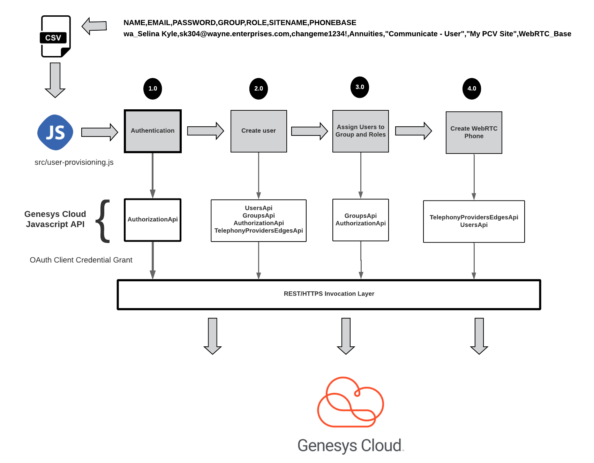
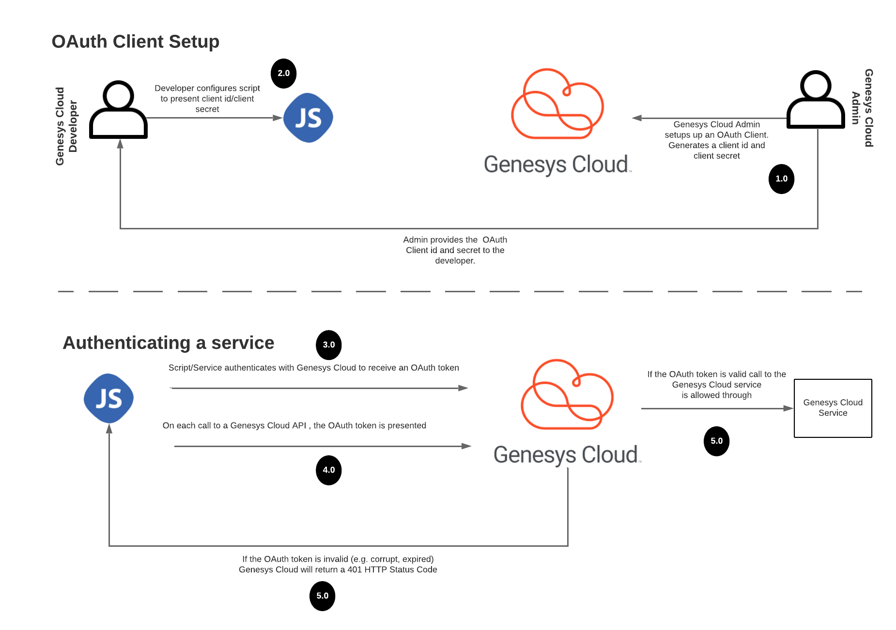

This module will cover how to authenticate the user-provisioning script with Genesys Cloud using the Genesys Cloud JavaScript API. [1]

In terms of the overall architecture, the diagram below will show the specific place in the user provisioning process we will be working in for this module:



## Authenticating with the Genesys Cloud

Genesys Cloud uses the OAuth2 2.0 specification [2] to handle all authentication requests coming from a third-party application or services. For the user provisioning script, we will be using an OAuth 2.0 client credential grant. The OAuth 2.0 credential grant is the appropriate form of authentication to use when using an application, script or service needs to communicate with Genesys Cloud as non-user. Typically credential grants are used when building integrations from a third-party application or service to Genesys Cloud. 

##CALLOUT //TODO Replace with call out markup
It is extremely tempting to use the client credential grant for most of your integrations.  However, the client credential grant is specifically designed for headless applications (e.g scripts and backend processing).  However, if you are going to have an end-user calling your service via a web or mobile application and the service calls Genesys Cloud APIs, you should use the OAuth 2.0 Authorization Code grant type.  Many Genesys Cloud APIs require that you use the Authorization Code grant because they require the user context to function.  For additional material, on using the Authorization code grant type see Genesys Cloud's Authorization Code Grant page. [3] 

The diagram below illustrates how an OAuth 2.0 client credential grant occurs between a service and Genesys Cloud.



You can see from the diagram above, that using an OAuth 2.0 credential grant requires 5 steps:

1. With an OAuth 2.0 client credential grant, a Genesys Cloud administrator sets up an OAuth client in Genesys Cloud and provides the developer's script/service with the client id and client secret that is created at the time the OAuth client was configured. The configuring of the OAuth Client for an application or service is a one-time setup.

2. The developer then configures the script (in our case the user-provisioning script), to have access to the client id and client secret. These values are usually accessed by the service via a configuration file, environment variables or a secrets repository.

3. When the service, needs to authenticate they present this client id and client secret to Genesys Cloud's OAuth service and if these two items are valid, Genesys Cloud will return an OAuth token that can then be presented with each request made to Genesys Cloud.

**Note: Asking for a token does not happen with every call to Genesys Cloud**

4. When the script wants to carry out an action with Genesys Cloud, it will present the OAuth token along with the request. Genesys Cloud will inspect the OAuth token.

5. If the OAuth token is valid (e.g. it has not expired or been tampered with), Genesys Cloud will let the request through to the targeted API. If the token is invalid, Genesys Cloud will return a 401 (Unauthorized) HTTP status code.

**Call Out** An OAuth token has a limited shelf life and will expire. It is the responsibility of the application or script to re-authenticate itself when a token expires.

While this seems a lot of work, in practice if you use the Genesys Cloud SDKs, the process of authentication is extremely simple.

Let's take a look at the `src/user-provisioning.js` file and watch how we are perform authentication against Genesys Cloud and then begin the provisioning process.

```javascript
const dotenv = require('dotenv');
const authApiProxy = require('./proxies/authenticateapi');
const provision = require('./provision');

dotenv.config();
const filename = process.argv[2];

//Main function
(async () => {
  console.log(`Starting the user provisioner to parse csv file ${filename}`);
  const token = await authApiProxy.authenticate(process.env.GENESYS_CLIENT_ID, process.env.GENESYS_CLIENT_SECRET);

  //console.log(`token: ${JSON.stringify(token, null, 4)}`);
  await provision.createUsers(filename);
})();

```

For purposes of the user-provisioning scripts, we wrap all of the calls out to the Genesys Cloud API's in their own files (under the `proxies` directory) that will perform the calls against the SDK. To begin the authentication process we call the `authApiProxy.authenticate()` method:

```javascript
 const token = await authApiProxy.authenticate(process.env.GENESYS_CLIENT_ID, process.env.GENESYS_CLIENT_SECRET);
```

For the `user-provisioning.js` script we pull the OAuth client id and OAuth client secret directly from an environment variable and pass them to `authApiProxy.authenticate()`.
The source code for the `authenticate()` function can be found at the `proxies/authenticateapi.js` file.

```javascript
const platformClient = require('purecloud-platform-client-v2');

/*
   The authenticate function is going to take the OAuth client id and secret and get a OAuth client credential token
   that will be used for all of the Javascript API calls.
*/
async function authenticate(clientId, clientSecret) {
  const client = platformClient.ApiClient.instance;

  try {
    return await client.loginClientCredentialsGrant(clientId,clientSecret);
  } catch (e) {
    console.error(`Authentication error has occurred.`, e);
    process.exit(1);
  }
};

exports.authenticate = authenticate;
```

There are three keys things to takeaway from the code above. First, in order to use the Genesys Cloud API (formerly known as PureCloud) we need to import the `purecloud-platform-client-v2` to make the Genesys Cloud functions available for use. This is done via the following code:

```javascript
const platformClient = require('purecloud-platform-client-v2');
```

Second, we need to retrieve an instance of the class in the Genesys Cloud Javascript SDK we are going to use. The Genesys Cloud API is grouped into classes based on their functionality and mirrors how the Genesys Cloud REST APIs are organized. You can see this organization of REST APIs in the Developer Center API documents [4] or via the Developer Tools API explorer [5].

In the `authenticate()` method we need to retrieve an instance of the `ApiClient`.

```javascript
const client = platformClient.ApiClient.instance;
```

Now with the client instance at hand, we can authenticate using the `loginClientCredentialsGrant()` method on the `client` instance. We pass in the client id and secret.

```javascript
return await client.loginClientCredentialsGrant(clientId,clientSecret);
```

**Note:** The Genesys Cloud JavaScript SDK returns a JavaScript `Promise` on all of its SDK calls. This means that when you make a call against the API in the JavaScript SDK, you must either use the `Promises.then().catch()` approach for processing the results of the call or the `async/await` approach. The approach you choose is based on your personal preference.

Most of the code in this developer starting guide will use the `async/await` approach. Once the authentication process has successfully completed, the function returns a Promise that resolves to an instance of `AuthDat`. The contents of the `AuthData` class will be covered later on in next section.

At this point the Genesys Cloud Javascript SDK will cache the return OAuth token and use it on every SDK call. You do not need to do anything else with the token unless it expires. If a token expires, your application will need to re-authenticate using its client id and client secret.

## OAuth Token Expiration

When an OAuth client is setup in Genesys Cloud, the administrator will configure how long (in seconds) the token will be valid for this specific OAuth client. When `loginClientCredentialsGrant()` is called you will retrieve an `AuthData` object containing the following information:

1. **accessToken**: The OAuth token that will be presented on each SDK call.
2. **tokenExpiryTime**: The milliseconds representation of the GMT date when the token will expire
3. **tokenExpiryTimeString**: The GMT date/time the token will expire

If you were to log the data within the `AuthData` object using a `` console.log(`token: ${JSON.stringify(token, null, 4)}`); ``, you would see output that might look something like this:

```javascript
token: {
        "accessToken": "pwxIgt61u6M4ARHcMz-1h5fTv073I2LbQAz50InVfMzDDv0vy9Ecaw0JYjgjy3Dyul7ULvTUAWU1p5IFDSy02A",
        "tokenExpiryTime": 1600538659506,
        "tokenExpiryTimeString": "Sat, 19 Sep 2020 18:04:19 GMT"
}
```

At this point, the user-provisioning script is now authenticated and can begin the process of creating users.

# OAuth Client and Token Best Practices

Before we wrap up this module, we do need to spend some time thinking about how to set up and use OAuth clients. New developers usually just setup a single OAuth client with a admin permissions and they are off writing code. They reuse the same OAuth client across all of their integrations and do not clearly separate real-time integrations with batch job integrations. This can be problematic. For example, lets say one of your scripts begins getting rate-limited or acting in abusive manner towards a Genesys Cloud service or resource. If the script is getting rate limited, all applications using that OAuth client will be rate-limited.

If the script is acting abusively or causing a performance issue within Genesys Cloud, a Genesys Cloud on-call support engineer be paged and will have to evaluate the risk your OAuth client is causing to the overall platform health. As part of the their support playbooks the on-call engineer may have to revoke the misbehaving OAuth Clients credentials until the issue can be resolved. If multiple integrations share the same OAuth client, this can take down your entire Call Center. This is why it is critical to think through how you are going to structure your OAuth Clients. Here are some general guidelines:

1. **Do not group batch integrations and real-time integrations under the same OAuth client**. Often times batch jobs will be the thing that can either create a rate-limiting situation or unearth a performance problem in Genesys Cloud. Different integrations have different uptime and performance characteristics so think carefully before using an OAuth client across these different types of integrations.
2. **For new scripts or services, consider setting up an a separate OAuth client for them so that they can easily be shutdown without impacting critical contact center functions.** Personally, I recommend setting a separate OAuth client for each integration or service you are building.
3. **Provide a clear, descriptive name and description for your OAuth client**. In the event there is an incident with a script, the Genesys Cloud on-call support engineers will look at your OAuth client's name and description to help ascertain the risks of shutting down your client.
4. **Do not over-privilege your OAuth client**. While an OAuth token will expire, if the OAuth token is hijacked or compromised, and the OAuth client that issues the token has more privileges then it needs, this will cause an unnecessary risk to your Genesys Cloud account and the data in it.
5. **Be aggressive with your token time-outs**. While you can set your tokens to timeout for up to 24 hours, this can increase the surface an attacker has to (ab)use a token before it expires.
6. **Do not setup multiple OAuth Clients to sidestep Genesys Cloud rate-limits**. OAuth Clients have a rate limit of 300 requests per minute. [6] Do not attempt to setup multiple OAuth Clients that your application uses to side step. This is considered abusive behavior and may result in all of your OAuth Clients credentials revoked.

# Summary

In this module we:

1.  Learned how to authenticate a script or service with Genesys Cloud using OAuth2.
2.  Walked through the Genesys Cloud Javascript SDK and used it to authenticate the user-provisioning script.
3.  Reviewed how OAuth 2 tokens expiration and how to deal with an expired token.
4.  Reviewed best practices related to how you setup your OAuth2 client level of responsibilities and permissions.

In the next module, we will review how we will parse the CSV file containing the Genesys Cloud user information and then create a user based on this information.

# References

1. [Genesys Cloud JavaScript API](/api/rest/client-libraries/javascript/)
2. [OAuth 2 Overview](/api/rest/authorization/index.html#access_tokens)
3. [OAuth 2 Authorization Code Overview](/api/rest/authorization/use-authorization-code.html)
4. [Developer Center API Guide](/api/rest/v2/)
5. [API Explorer](/developer-tools/#/api-explorer)
6. [API Rate Limits](/api/rest/tips/#api_rate_limiting)
