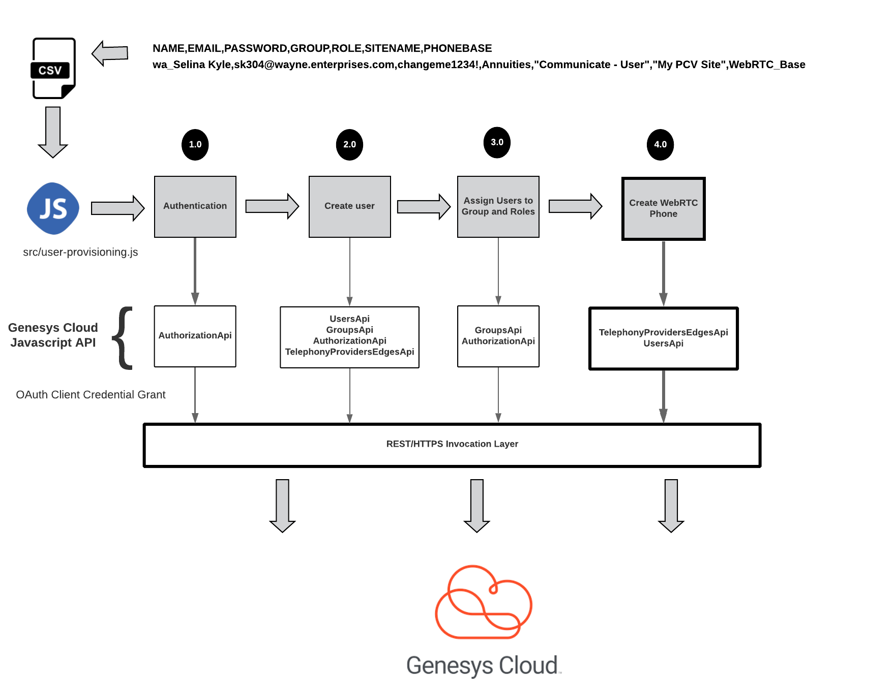
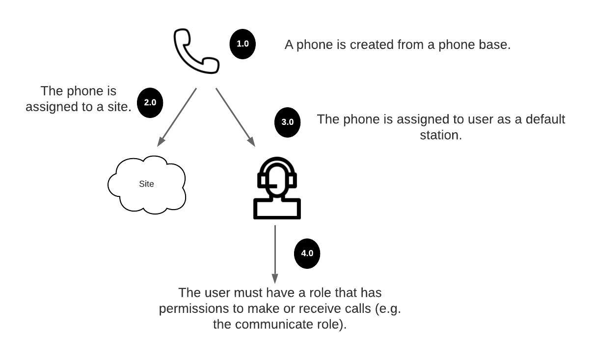

# Introduction

This is the last module in this developer starting guide.  At this point we have demonstrated:

1. How to create a user in Genesys Cloud. 
2. Lookup all the auxiliary information we will need to assign the user to a group, assign the user a role and create a WebRTC phone.
3. Assign the user to a group.
4. Assign the user to a role.

We are now going to show you how to create a WebRTC phone for a user and assign it to the user as a default station.  We are at this point in our architectural diagram we have been using for this tutorial.



Before we begin looking at the code to create a WebRTC phone and assign it to a user, we need to understand the relationship of how the phonebase, the phone, the site and the user's role fit together in setting up the phone.  The diagram below illustrates this relationship.



1. **A phone created from a phonebase**.  We are creating a phone using the WebRTC phonebase that is available for every Genesys Cloud organization.  Remember, a phonebase is a template containing the configuration for that particular style of phone.  Once the phone is created, the settings for that individual phone can be changed without changing the template.

2. **A phone is assigned a site.** Phones are assigned to site within Genesys Cloud when the phone is created. A site represents a geographic location.

3. **A user is assigned a phone as their default station**.  Once a phone is created, before it can be used, the user has to be logged into the phone.  Logging into the phone can be done manually by the user, but if the phone is defined as the user's default station, the user will automatically be logged into the phone the first time the user logs into their account.

4. **In order for a user to be able to use a phone to make and receive calls, they must have a role with the the proper permissions.**  Not all users can make and receive phone calls in Genesys Cloud.  In order to make a call with a phone, they must have a role assigned to them that has the proper permissions.  For this developer starting guide, we have assigned all of our users the `Communicate` role.

Let's begin our discussion by revisiting where we initiate the creation of a users's phone in our user provisioning script.  If you remember all the the processing done after the users are created is done in the `postUserCreation()` function in the `src/provisioning.js` file.

```javascript
async function postUserCreation(users) {
  //..Code removed for succinctness
  console.log(`Creating phones for users`);
  for (user of users) {
    await phoneApiProxy.createWebRTCPhone(user);
    await stationsApiProxy.assignUserToWebRtcPhone(user.id);
  }
}
```

The last line of this function, iterates over all of the created users and uses two function to create the users WebRTC phone and then assign the phone to the user: `phoneApiProxy.createWebRTCPhone()` and `stationsApiProxy.assignUserToWebRtcPhone()`.  

# Create the Web RTC Phone 
The `createWebRTCPhone()` function is located in the `src/proxies/phoneapi.js` file.  To create the phone we are going to use the `TelephonyProvidersEdgeApi` api. [1] The code for `createWebRTCPhone()` function is shown below.

```javascript
async function createWebRTCPhone(user) {
  let apiInstance = new platformClient.TelephonyProvidersEdgeApi();
  const phone = {
    name: `${user.NAME.replace(' ', '_')}_WEBRTC_PHONE`,
    state: 'active',
    site: {
      id: user.site.id,
      name: user.site.name,
      selfUri: user.site.selfUri,
    },
    phoneBaseSettings: {
      id: user.phonebase.id,
      name: user.phonebase.name,
      selfUri: user.phonebase.selfUri,
    },
    lineBaseSettings: {
      id: user.phonebase.lines[0].id,
      name: user.phonebase.lines[0].name,
      selfUri: user.phonebase.lines[0].selfUri,
    },
    phoneMetaBase: {
      id: 'inin_webrtc_softphone.json',
      name: 'PureCloud WebRTC Phone',
    },
    lines: [
      {
        name: user.phonebase.lines[0].name,
        lineBaseSettings: {
          id: user.phonebase.lines[0].id,
          name: user.phonebase.lines[0].name,
          selfUri: user.phonebase.lines[0].selfUri,
        },
      },
    ],
    capabilities: {
      provisions: false,
      registers: false,
      dualRegisters: false,
      hardwareIdType: 'mac',
      allowReboot: false,
      noRebalance: false,
      noCloudProvisioning: false,
      mediaCodecs: ['audio/opus'],
    },
    webRtcUser: {
      id: user.id,
      name: user.NAME.replace(' ', '_'),
    },
  };

  try {
    return await apiInstance.postTelephonyProvidersEdgesPhones(phone);
  } catch (e) {
    console.error(`Error has occurred while trying to create a phone for user.`, user, phone, e);
    return null;
  }
};
```

The actual call to create the phone is trivial and uses the ` apiInstance.postTelephonyProvidersEdgesPhones()` function,

```javascript
 try {
    return await apiInstance.postTelephonyProvidersEdgesPhones(phone);
  } catch (e) {
    console.error(`Error has occurred while trying to create a phone for user.`, user, phone, e);
    return null;
  }
  ```

However, the real challenge in creating a WebRTC phone is that the same API  `postTelephonyProvidersEdgesPhones()` is used to create not only WebRTC phones, but physical phones.  Since there is a massive amount of information that can be passed in creating the phone, JSON object passed into the `postTelephonyProvidersEdgesPhones()` call is extremely large and its API documentation is not clear.  So, in setting up a WebRTC phone you need to make sure (per the example above) that you properly set the following fields on the payload:

1. **name**.  This is the name of the phone.  This has to be a unique name and should be descriptive of who is going to own the phone.
2. **site**.  These values are derived directly from the site object we looked up earlier in the code.
3. **phoneBaseSettings**.  These values are created from the phoneBase object we looked up earlier in the code.
4. **lineBaseSettings**.  These are created from the phoneBase object we looked at up earlier in the code.
5. **webRtcUser**.  Used to uniquely represent the user of the phone in the WebRTC protocol.  This needs to be a unique name and the user id is used to populate this value.  When you create the phone and set the webRtcUser field, that WebRTC phone will only ever be available to that user.

All of the other parameters in the above code can be passed in as is. At this point, this code will have successfully created a WebRTC phone, but it is not yet available for the user to use.

# Assign the phone as a default station
In order for the WebRTC phone to be usable we now need to assign it to the user.  This is done `assignUserToWebRtcPhone()` function found `src/proxies/stationsapi.js` file.  The `assignUserToWebRtcPhone()` function is shown below.

```javascript
async function assignUserToWebRtcPhone(userId) {
  try {
    /*Get the station*/
    const station = await getStationByWebRtcUserId(userId);

    let apiInstance = new platformClient.UsersApi();
    /*Assign the station*/
    await apiInstance.putUserStationDefaultstationStationId(userId, station.id);
  } catch (e) {
    console.error(`Error occurred while assigning default station for userId ${userId}`, e);
  }
};
```

In order assign the user the WebRTC phone that was created for them we need to look up the station associated with the WebRTC phone.  Stations are automatically created behind the scenes in Genesys Cloud based on the `WebRtcUserId` defined when the phone is created.  In the code above, the station lookup code in encapsulated in the `getStationByWebRtcUserId()` function.

```javascript
async function getStationByWebRtcUserId(userId) {
  let opts = {
    webRtcUserId: userId,
  };

  let apiInstance = new platformClient.StationsApi();

  try {
    const results = await retry(
      async () => {
        const stations = await apiInstance.getStations(opts);
        /*If we cant find a station then throw an exception.  This will trigger a retry*/
        if (stations.entities.length === 0) {
          throw new Error('No station found, retrying');
        }

        return stations;
      },

      { delay: 1000, factor: 1, maxAttempts: 6 }
    );

    const station = {
      id: results.entities[0].id,
      webRtcUserId: results.entities[0].webRtcUserId,
      name: results.entities[0].name,
    };

    return station;
  } catch (err) {
    console.log(`Error while retrieving station with userId: ${userId}: ${JSON.stringify(err, null, 4)}`);
    return null;
  }
};
```

The code above is using the Stations API to retrieve a station by is `WebRtcUserId` value
```javascript
let opts = { webRtcUserId: userId, };

let apiInstance = new platformClient.StationsApi();
  try {
    const results = await retry(
      async () => {
        const stations = await apiInstance.getStations(opts);
        /*If we cant find a station then throw an exception.  This will trigger a retry*/
        if (stations.entities.length === 0) {
          throw new Error('No station found, retrying');
        }

        return stations;
      },

      { delay: 1000, factor: 1, maxAttempts: 6 }
    );
```

One of the things you may have noticed in the above code is that we are again wrapping the code with a `retry()` from the attempt library we saw in module 3. [3] **Why?**  When the `apiInstance.postTelephonyProvidersEdgesPhones()` function creates the WebRTC phone in Genesys Cloud, it creates the station, but then indexes the station in our ElasticSearch cluster.  The `apiInstance.getStations()` call when looking up the station by the `WebRtcUserId` uses the search cluster to retrieve the data.  The updating of the search cluster with the station information happens asynchronously.  So, the `retry()` function will retry 6 times at 1 second intervals to see if it can find the station information.

After the station information information is retrieved from the `getStationByWebRtcUserId()` function, we use the Genesys Cloud `Users` Api [4] to use associate the user id and the station together.

```javascript
async function assignUserToWebRtcPhone(userId) {
  try {
    /*Get the station*/
    const station = await getStationByWebRtcUserId(userId);

    let apiInstance = new platformClient.UsersApi();
    /*Assign the station*/
    await apiInstance.putUserStationDefaultstationStationId(userId, station.id);
  } catch (e) {
    console.error(`Error occurred while assigning default station for userId ${userId}`, e);
  }
};
```

# Verifying everything work

With our last call our work in this developer starting guide is complete.  So how do validate everything is working correctly and your created users have everything setup properly.  If you ran the code in this guide against your own CSV file, you should be able to:

1.  Log into Genesys Cloud as one of the created user.  **Note**: When a user is created Genesys Cloud will send an email to the email specified as the username with a link to reset their password and login.  If you are testing a fake account, you can reset the password by going to the admins screen-> people  and then resetting the password on the individual user.
2.  Go to the chat icon on the right of the screen and see your assigned chat group in your window.
3.  Go the phone icon on the right of your screen.  If your phone was created and assigned properly, your phone icon should be a white color. If the phone is not setup properly, you will see a red outline on the phone with a slash through the phone.
4.  To make a call click, on the phone icon, dial a number and you should hear the phone dial and ring.

# Summary

In this final module you used the Genesys Cloud API to:

1. Create a WebRTC Phone for an user.
2. Lookup the underlying station for that user and deal with the eventual consistency design of the API.
3. Assign the WebRTC Phone to the User.

# Reference
1. [Telephony Provider API](/api/rest/v2/telephonyprovidersedge/)
2. [Stations API](/api/rest/v2/stations/)
3. [Attempt](https://github.com/lifeomic/attempt)
4. [Users API](/api/rest/v2/users)